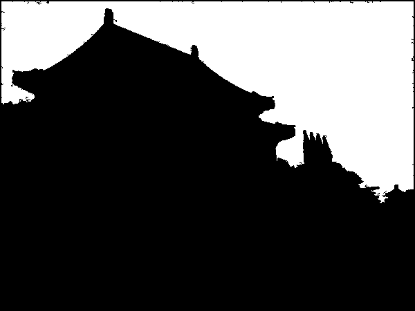
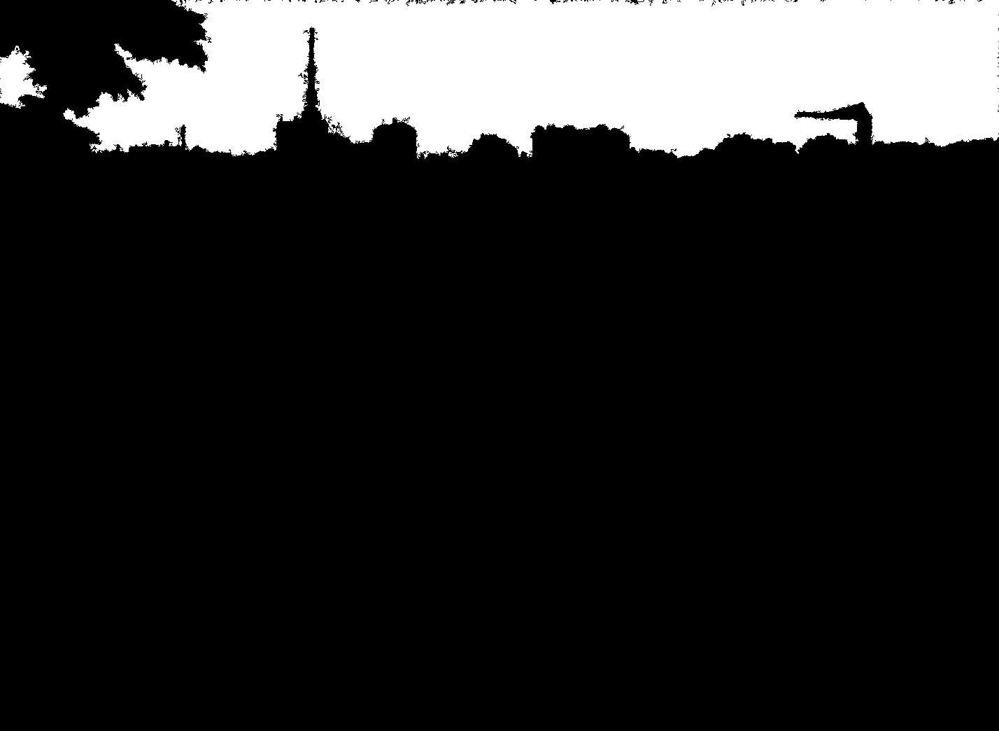
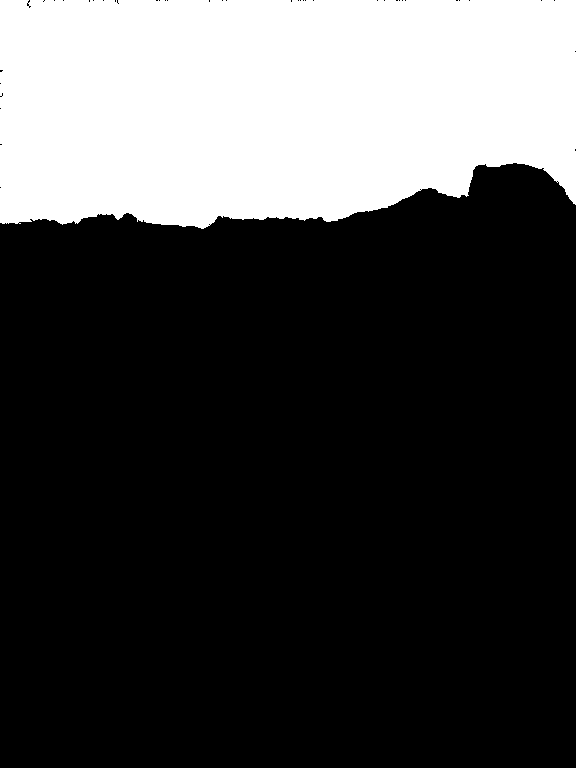
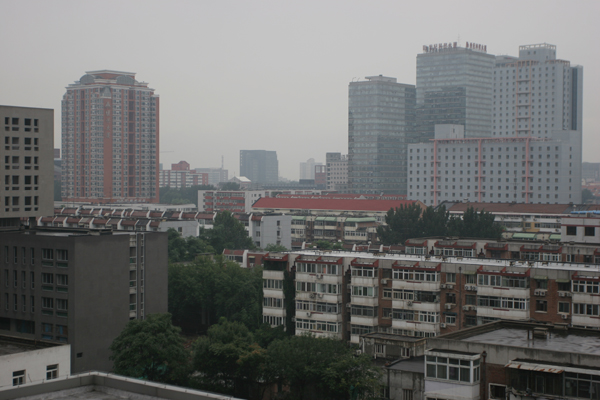
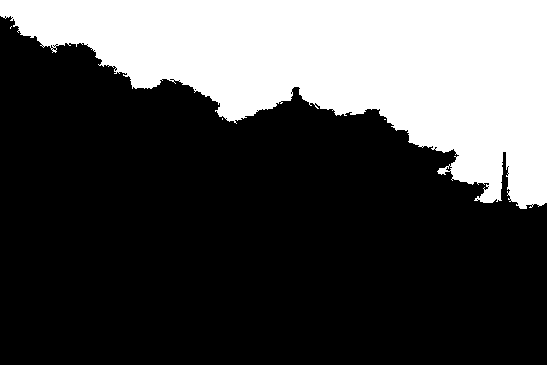
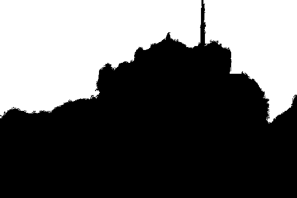

# HazyImageOrientedSkyAreasDetection

There are some example of this method.

<figure class="half">
    
    
</figure>

<figure class="half">
    
    
</figure>

<figure class="half">
    
    
</figure>

<figure class="half">
    
    
</figure>

<figure class="half">
    
    
</figure>

<figure class="half">
    
    
</figure>

